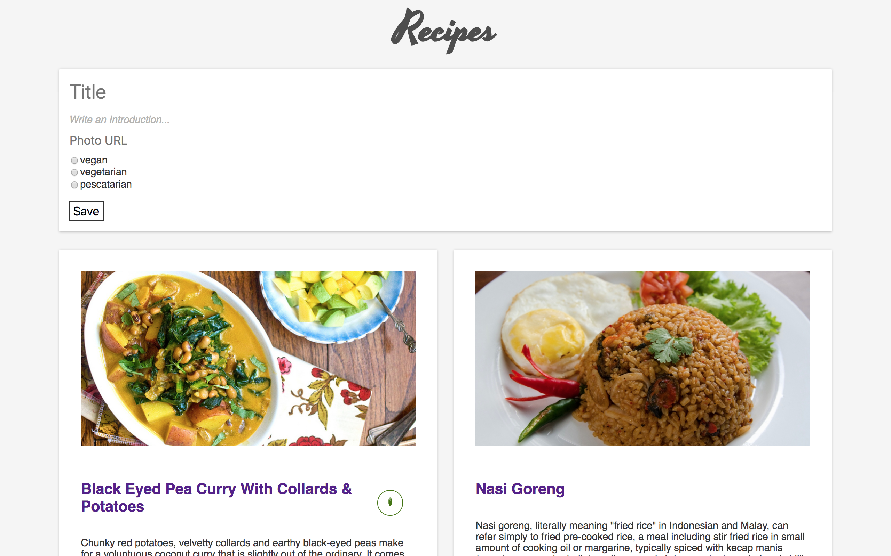
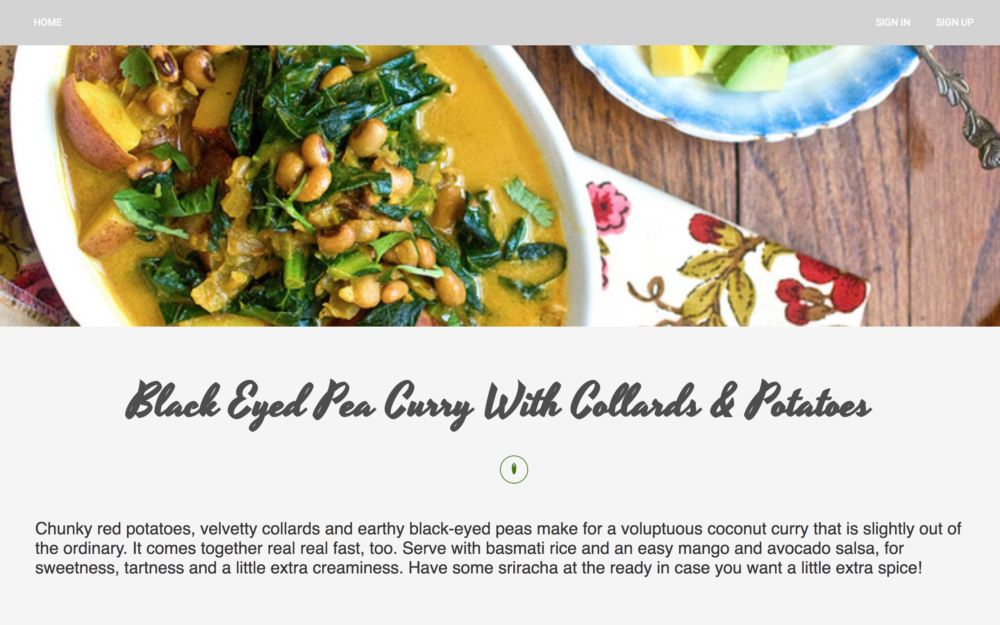

# Recipes

Express app made during week 5-6 of the 9-week Codaisseur Academy. The frontend for this app can be found [here](https://github.com/Abohte/recipes-react).

This app, containing a list of recipes, was an exercise to get to know React / Redux, Express, MongoDB and Material-UI.




## Steps

While working on this app we followed these steps:

1. Setting up frontend with React.
2. Adding Redux with actions.
3. Setting up backend with Express and MongoDB.
4. Creating models, schema, routes.
5. Including authentication.
6. Connecting frontend and backend.
7. Adding Material-UI components.

## Running Locally

Make sure you have [Node.js](https://nodejs.org/en/) and [Yarn](https://yarnpkg.com/lang/en/) installed.

```bash
git clone git@github.com:Abohte/recipes-express.git
cd recipes-express
yarn install
yarn run seed
yarn start
```

Then get the [frontend](https://github.com/Abohte/recipes-react) up.
